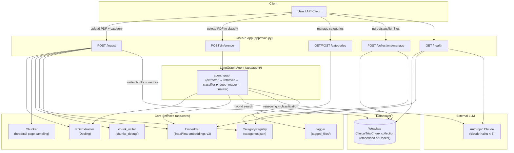
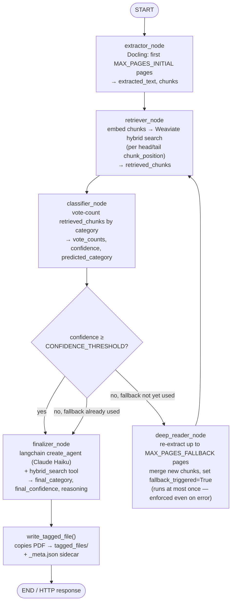

# Clinical Trial Document Tagger

AI-powered classification of clinical trial PDFs (Protocol, SAP, ICF, CSR, IB, Combined, or any
custom category you register) using a LangGraph agent backed by Weaviate for retrieval and
Claude for final reasoning.

## Table of Contents

- [Architecture](#architecture)
- [Inference Pipeline Flow](#inference-pipeline-flow)
- [Project Structure](#project-structure)
- [Setup](#setup)
- [Running the App](#running-the-app)
- [API Reference](#api-reference)
- [Runtime Data Directories](#runtime-data-directories)
- [Diagnostic Scripts](#diagnostic-scripts)
- [Configuration Reference](#configuration-reference)

## Architecture



**Key design points:**

- **Dynamic categories** — categories are not a hardcoded enum. `CategoryRegistry` (`app/core/category_registry.py`) seeds a default set (`Protocol, SAP, ICF, CSR, IB, Combined`) and persists any additions to `categories.json`, so new document types can be registered at runtime via `POST /categories`.
- **Weaviate as the single source of truth for chunks** — every ingested chunk is stored with `filename`, `category`, `chunk_index`, `chunk_position` (`head`/`tail`), `page_range`, `content`, and `source_type`. `filename`/`category`/`chunk_position`/`source_type` use `Tokenization.FIELD` so filters are exact-match, not fuzzy word-token matches.
- **Hybrid search, no reranker** — retrieval uses Weaviate's native `hybrid()` query (BM25 + vector, no external reranker/Cohere dependency).
- **Embedded or Docker Weaviate** — controlled by `USE_WEAVIATE_EMBEDDED`; the embedded client self-heals around stale/orphaned processes (e.g. left behind by a `--reload` dev server restart).
- **Debug artifacts, not application state** — `chunks_debug/` (per-file chunk dumps for QA) and `tagged_files/` (copies of classified PDFs + metadata) are side-effect outputs, not read back by the app.

## Inference Pipeline Flow

`POST /inference` runs a compiled LangGraph state machine (`app/agent/graph.py`) with a hard cap
of **one** deep-read fallback pass per request:



Notes:
- The `classifier → deep_reader → retriever → classifier` loop can execute **at most once** — `fallback_triggered` is set unconditionally (success or failure) so a broken extraction can't cause an infinite retry loop.
- `finalizer_node` uses `langchain.agents.create_agent` (LangChain's current agent constructor — the older `create_react_agent` was removed in LangChain 1.0) with a single `hybrid_search` tool the LLM can call for additional grounding.
- A tagged file is only written for a genuinely successful classification (non-empty `final_category`), not on hard errors.

## Project Structure

```
clinical_trial_tagger/
├── app/
│   ├── main.py                     # FastAPI app + router registration
│   ├── core/
│   │   ├── config.py               # pydantic-settings (.env-backed)
│   │   ├── category_registry.py    # dynamic category CRUD + categories.json persistence
│   │   ├── extractor.py            # Docling PDF → markdown
│   │   ├── chunker.py              # head/tail page-sampling + markdown splitter
│   │   ├── embedder.py             # jina-embeddings-v3 wrapper
│   │   ├── chunk_writer.py         # chunks_debug/ QA dumps (ingestion)
│   │   └── tagger.py               # tagged_files/ output (inference)
│   ├── db/
│   │   └── weaviate_client.py      # WeaviateStore: schema, CRUD, hybrid search, stats
│   ├── agent/
│   │   ├── state.py                # AgentState TypedDict
│   │   ├── graph.py                # LangGraph StateGraph wiring
│   │   ├── tools.py                # hybrid_search tool for the finalizer LLM
│   │   └── nodes/
│   │       ├── extractor.py
│   │       ├── retriever.py
│   │       ├── classifier.py
│   │       ├── deep_reader.py
│   │       └── finalizer.py
│   ├── api/routes/
│   │   ├── health.py                # GET  /health
│   │   ├── ingest.py                # POST /ingest
│   │   ├── inference.py             # POST /inference
│   │   ├── categories.py            # GET/POST /categories
│   │   └── collections.py           # POST /collections/manage
│   └── schemas/                     # pydantic request/response models
├── scripts/
│   ├── diagnose_category_casing.py  # read-only Weaviate/registry consistency check
│   └── fix_category_casing.py       # migration: normalize mis-cased category values
├── requirements.txt
├── docker-compose.yml                # optional: Weaviate via Docker instead of embedded
├── .env.example
└── categories.json / chunks_debug/ / tagged_files/ / weaviate_data/   # runtime state (gitignored)
```

## Setup

### Prerequisites

- Python 3.12
- An Anthropic API key
- Either nothing extra (embedded Weaviate, default) or Docker (for Docker-based Weaviate)

### 1. Create and activate a virtual environment

```bash
cd clinical_trial_tagger
python3 -m venv venv
source venv/bin/activate
```

### 2. Install dependencies

```bash
pip install --upgrade pip
pip install -r requirements.txt
```

`jinaai/jina-embeddings-v3` loads via `trust_remote_code=True` and needs `einops` + `peft`
(already listed in `requirements.txt`) — the first run downloads the model weights from
Hugging Face, so expect a delay and disk usage (~a few hundred MB) the first time the app
starts.

### 3. Configure environment variables

```bash
cp .env.example .env
```

Edit `.env` and set at minimum:

```bash
ANTHROPIC_API_KEY=sk-ant-...          # required — classification LLM calls will fail without it
USE_WEAVIATE_EMBEDDED=true             # true = no Docker needed; false = use docker-compose Weaviate
```

See [Configuration Reference](#configuration-reference) below for every setting.

### 4. Choose a Weaviate backend

**Option A — Embedded (default, simplest):** nothing to do. `USE_WEAVIATE_EMBEDDED=true` makes
the app spin up its own local Weaviate binary on first connection (data persisted to
`./weaviate_data/`).

**Option B — Docker:**

```bash
docker-compose up -d
```

Then set `USE_WEAVIATE_EMBEDDED=false` and `WEAVIATE_URL=http://localhost:8080` in `.env`.

## Running the App

```bash
./venv/bin/uvicorn app.main:app --reload --port 8000
```

Interactive API docs (Swagger UI) will be available at `http://localhost:8000/docs`.

### Quick smoke test

```bash
curl http://localhost:8000/health
```

## API Reference

| Method | Path | Purpose |
|---|---|---|
| `GET` | `/health` | Checks Weaviate connectivity, embedding model load, and Anthropic connectivity |
| `POST` | `/ingest` | Bootstrap-ingest a labeled PDF (multipart form: `file`, `category`) into Weaviate |
| `POST` | `/inference` | Classify an unlabeled PDF (multipart form: `file`) via the LangGraph agent |
| `GET` | `/categories` | List all registered categories |
| `POST` | `/categories` | Register a new category (JSON body: `name`, optional `description`) |
| `POST` | `/collections/manage` | Admin actions on the Weaviate collection: `stats`, `list_files`, `delete_by_category`, `delete_by_filename`, `purge_all` |

### Example: ingest a labeled document

```bash
curl -X POST http://localhost:8000/ingest \
  -F "file=@/path/to/NCT12345678_Prot_000.pdf" \
  -F "category=Protocol"
```

### Example: classify an unlabeled document

```bash
curl -X POST http://localhost:8000/inference \
  -F "file=@/path/to/unknown_document.pdf"
```

### Example: register a new category

```bash
curl -X POST http://localhost:8000/categories \
  -H "Content-Type: application/json" \
  -d '{"name": "Amendment", "description": "Protocol amendment documents"}'
```

### Example: collection stats

```bash
curl -X POST http://localhost:8000/collections/manage \
  -H "Content-Type: application/json" \
  -d '{"action": "stats"}'
```

### Example: purge everything (requires explicit confirmation header)

```bash
curl -X POST http://localhost:8000/collections/manage \
  -H "Content-Type: application/json" \
  -H "X-Confirm-Purge: yes" \
  -d '{"action": "purge_all"}'
```

## Runtime Data Directories

These are created lazily on first use and are **gitignored** — they are not source code or
committed fixtures:

| Path | Created by | Purpose |
|---|---|---|
| `weaviate_data/` | embedded Weaviate client | Vector DB persistence (only when `USE_WEAVIATE_EMBEDDED=true`) |
| `categories.json` | `CategoryRegistry.__init__` | Persisted list of registered categories beyond the defaults |
| `chunks_debug/{filename}/` | `write_chunk_debug()` on `/ingest` | `metadata.json` + `chunks.txt` per ingested file, for manually inspecting chunking output |
| `tagged_files/` | `write_tagged_file()` on `/inference` | Copy of each successfully classified PDF, renamed `{name}_[{category}].pdf`, plus a `_meta.json` sidecar |

## Diagnostic Scripts

Run these with the app's venv, against a running Weaviate instance (embedded or Docker):

```bash
# Read-only check: are any category values stored with inconsistent casing
# relative to the category registry (which would split classifier votes)?
./venv/bin/python scripts/diagnose_category_casing.py

# Migration: normalize any mis-cased category values found above to the
# registry's canonical spelling.
./venv/bin/python scripts/fix_category_casing.py
```

`POST /ingest` already canonicalizes category casing at write time, so the migration script
should only ever need to fix historical data, not ongoing ingestion.

## Configuration Reference

All settings are read from `.env` via `app/core/config.py` (`pydantic-settings`):

| Variable | Default | Description |
|---|---|---|
| `ANTHROPIC_API_KEY` | `""` | Required for `/inference` and `/health`'s LLM check |
| `WEAVIATE_URL` | `http://localhost:8080` | Used only when `USE_WEAVIATE_EMBEDDED=false` |
| `WEAVIATE_API_KEY` | `""` | Optional, for a secured remote/Docker Weaviate |
| `USE_WEAVIATE_EMBEDDED` | `false` (see `.env.example`: `true`) | `true` = embedded local binary, `false` = connect to `WEAVIATE_URL` |
| `EMBEDDING_MODEL` | `jinaai/jina-embeddings-v3` | SentenceTransformer model id, loaded with `trust_remote_code=True` |
| `EMBEDDING_DIMENSIONS` | `1024` | Informational; must match the model's actual output dimension |
| `TOP_K_RETRIEVAL` | `10` | Hybrid search result count per chunk-position group during retrieval |
| `CONFIDENCE_THRESHOLD` | `0.85` | Vote-count confidence required to skip the deep-read fallback |
| `MAX_PAGES_INITIAL` | `3` | Pages read on the first extraction pass during inference |
| `MAX_PAGES_FALLBACK` | `8` | Pages read during the one-time deep-reader fallback pass |
| `PDF_INPUT_DIR` | `../clinical_trial_pdfs` | Informational default location for source PDFs |
| `LOG_LEVEL` | `INFO` | Python logging level |
